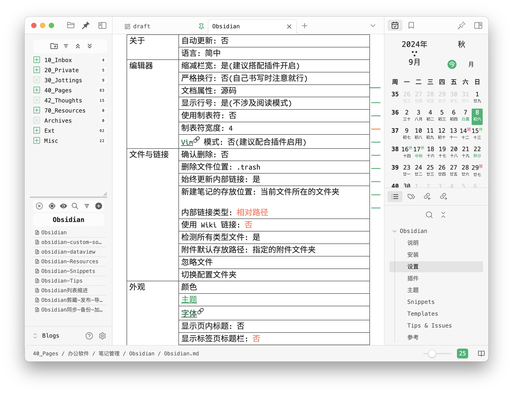

# README

## Overview



- Obsidian 版本 | 1.7.7-mac-arm64
- 主题 | 默认
- ribbon | 基本上不用
- 标题栏 | 隐藏 | 用 editing-toolbar 和 quick-explorer 替代

## Top folders

- 10_Inbox
- 20_Private
- 30_Jottings
- 40_Pages
- 42_Thoughts
- Archives
- Misc
    - Attachments
    - Templates

## Settings

```json
{
  "defaultViewMode": "preview",
  "livePreview": true,
  "readableLineLength": true,
  "strictLineBreaks": false,
  "propertiesInDocument": "visible",
  "useTab": false,
  "trashOption": "local",
  "promptDelete": false,
  "alwaysUpdateLinks": true,
  "newFileLocation": "current",
  "newLinkFormat": "relative",
  "useMarkdownLinks": true,
  "showUnsupportedFiles": true,
  "attachmentFolderPath": "Misc/Attachments",
  "showInlineTitle": false,
  "showRibbon": false,
  "vimMode": false,
  "showLineNumber": false,
  "pdfExportSettings": {
    "pageSize": "A4",
    "landscape": false,
    "margin": "0",
    "downscalePercent": 100
  },
  "mobileToolbarCommands": [
    "editor:undo",
    "editor:redo",
    "editor:swap-line-up",
    "editor:swap-line-down",
    "editor:indent-list",
    "editor:unindent-list",
    "editor:insert-wikilink",
    "editor:insert-embed",
    "editor:insert-tag",
    "editor:attach-file",
    "editor:set-heading",
    "editor:toggle-bold",
    "editor:toggle-italics",
    "editor:toggle-strikethrough",
    "editor:toggle-highlight",
    "editor:toggle-code",
    "editor:toggle-blockquote",
    "editor:insert-link",
    "editor:toggle-bullet-list",
    "editor:toggle-numbered-list",
    "editor:toggle-checklist-status",
    "editor:configure-toolbar"
  ]
}
```

### Hotkeys

| command                                                               | keys                |
| --------------------------------------------------------------------- | ------------------- |
| app:go-back                                                           | Mod+[               |
| app:go-forward                                                        | Mod+]               |
| app:toggle-left-sidebar                                               | Ctrl+L              |
| app:toggle-right-sidebar                                              | Ctrl+R              |
| app:toggle-ribbon                                                     | Mod+Ctrl+B          |
| cycle-in-sidebar:cycle-left-sidebar                                   | Ctrl+[              |
| cycle-in-sidebar:cycle-left-sidebar-reverse                           | Ctrl+Shift+[        |
| cycle-in-sidebar:cycle-right-sidebar                                  | Ctrl+]              |
| cycle-in-sidebar:cycle-right-sidebar-reverse                          | Ctrl+Shift+]        |
| cycle-through-panes:cycle-through-panes                               | Ctrl+Tab            |
| cycle-through-panes:cycle-through-panes-reverse                       | Ctrl+Shift+Tab      |
| daily-notes                                                           | Mod+J               |
| darlal-switcher-plus:switcher-plus:open                               | Mod+Shift+O         |
| darlal-switcher-plus:switcher-plus:open-commands                      | Mod+Shift+P         |
| editing-toolbar:editor:toggle-bold                                    | Alt+B               |
| editing-toolbar:editor:toggle-highlight                               | Alt+H               |
| editing-toolbar:editor:toggle-italics                                 | Alt+I               |
| editing-toolbar:editor:toggle-strikethrough                           | Alt+S               |
| editing-toolbar:underline                                             | Alt+U               |
| editor:fold-all                                                       | Alt+Z               |
| editor:swap-line-down                                                 | Alt+ArrowDown       |
| editor:swap-line-up                                                   | Alt+ArrowUp         |
| editor:table-col-left                                                 | Mod+Alt+ArrowLeft   |
| editor:table-col-right                                                | Mod+Alt+ArrowRight  |
| editor:table-row-down                                                 | Mod+Alt+ArrowDown   |
| editor:table-row-up                                                   | Mod+Alt+ArrowUp     |
| editor:toggle-source                                                  | Alt+Mod+E           |
| float-search:search-obsidian-globally                                 | Mod+Shift+F         |
| floating-toc:scroll-to-bottom                                         | Mod+Ctrl+ArrowDown  |
| floating-toc:scroll-to-top                                            | Mod+Ctrl+ArrowUp    |
| fuzzy-chinese-pinyin:execute-command                                  | Mod+P               |
| fuzzy-chinese-pinyin:open-search                                      | Mod+O               |
| homepage:open-homepage                                                | Ctrl+Alt+H          |
| hotkey-helper:browse-plugins                                          | Ctrl+P              |
| hotkeysplus-obsidian:duplicate-lines-down                             | Alt+Shift+ArrowDown |
| hotkeysplus-obsidian:duplicate-lines-up                               | Alt+Shift+ArrowUp   |
| make-md:mk-blink                                                      | Mod+Shift+O         |
| obsidian-another-quick-switcher:search-command_file-name-fuzzy-search | Mod+Shift+O         |
| obsidian-footnotes:insert-autonumbered-footnote                       | Alt+0               |
| obsidian-footnotes:insert-named-footnote                              | Alt+-               |
| obsidian-hover-editor:open-new-popover                                | Ctrl+Alt+H          |
| obsidian-kanban:toggle-kanban-view                                    | Alt+K               |
| obsidian-markmind:Toggle to markdown or mindmap                       | Alt+M               |
| omnisearch:show-modal                                                 | Mod+Shift+F         |
| quickadd:choice:3c55de5c-97b0-429c-9e0c-3335df22fa10                  | Ctrl+C              |
| quickadd:choice:d03adf12-a165-4b3e-b1e0-4d05983a64dd                  | Mod+R               |
| quickadd:runQuickAdd                                                  | Alt+Q               |
| refresh-preview:refresh-preview                                       | Mod+R               |
| vim-toggle:toggle-vim                                                 | Ctrl+V              |
| workspace:split-horizontal                                            | Ctrl+Alt+ArrowDown  |
| workspace:split-vertical                                              | Ctrl+Alt+ArrowRight |
| zk-prefixer                                                           | Alt+T               |

## Plugins

```md
advanced-canvas
any-block
attachment-flow-plugin
attachment-management
attachment-pro
better-export-pdf
better-fn
better-markdown-links
cm-chs-patch
cmdr
code-styler
custom-sort
cycle-in-sidebar
darlal-switcher-plus
dataview
dust-calendar
easy-typing-obsidian
editing-toolbar
editor-width-slider
file-tree-alternative
find-unlinked-files
float-search
floating-settings
floating-toc
fuzzy-chinese-pinyin
hotkey-helper
image-captions
image-converter
janitor
keyboard-analyzer
lazy-plugins
ledger-obsidian
links
make-md
markdown-table-editor
mysnippets-plugin
nldates-obsidian
note-refactor-obsidian
obsidian-advanced-uri
obsidian-auto-hide
obsidian-auto-link-title
obsidian-columns
obsidian-completr
obsidian-excalidraw-plugin
obsidian-export-image
obsidian-footnotes
obsidian-front-matter-title-plugin
obsidian-git
obsidian-heading-shifter
obsidian-hover-editor
obsidian-importer
obsidian-kanban
obsidian-latex-suite
obsidian-linter
obsidian-list-callouts
obsidian-markmind
obsidian-meta-bind-plugin
obsidian-opener
obsidian-outliner
obsidian-plugin-proxy
obsidian-projects
obsidian-relative-line-numbers
obsidian-spaced-repetition
obsidian-style-settings
obsidian-tagfolder
obsidian-tasks-plugin
obsidian-view-mode-by-frontmatter
obsidian-zoom
obsidian42-brat
omnisearch
open-sidebar-on-hover
quick-explorer
quickadd
recent-files-obsidian
refresh-preview
remotely-save
settings-search
show-whitespace-cm6
solve
statusbar-organizer
supercharged-links-obsidian
surfing
table-editor-obsidian
templater-obsidian
typewriter-mode
update-relative-links
url-into-selection
vare
various-complements
vim-toggle
virtual-linker
```

## Templates

```dataview
list rows.file.link
from "Misc/Templates"
sort file.name desc
group by file.folder
```

## Changelog

- [2024-07-13] 重命名 90_Misc 为 Misc
- [2024-07-18] 重命名 20_Journals 为 20_Private; 增加 Changelog
- [2024-07-18] 更改日期格式 YYYY/MM/DD 为 YYYY-MM-DD
- [2024-07-20] 将 Local、draft 移到 Inbox 中
- [2024-07-27] ~~取消顶层目录名中的前缀编号~~
- [2024-07-28] 禁用 Surfing 插件(不影响 canvas 中的网页)
- [2024-10-04] 拆分库, 重新启用本 repo
