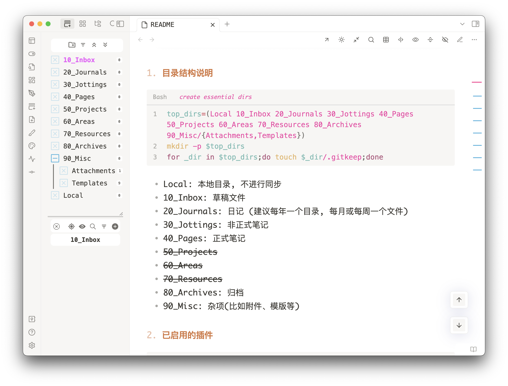
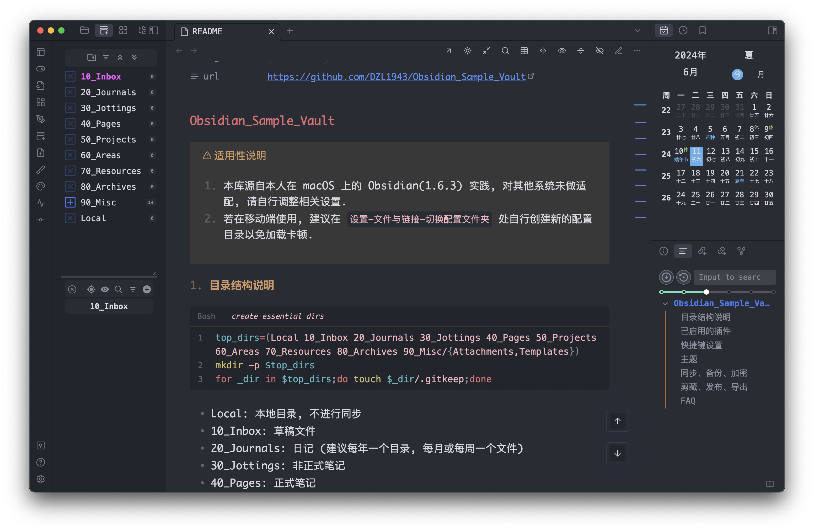

# obsidian-sample-vault

> [!attention]+ 适用性说明
> 1. 本库源自本人在 macOS 上的 Obsidian(1.6.x) 实践, 对其他系统未做适配, 请自行调整相关设置.
> 2. 若在移动端使用, 建议在 `设置-文件与链接-切换配置文件夹` 处自行创建新的配置目录以免加载卡顿, 建议默认编辑模式设为源码模式.

  


## 主流的笔记软件

- 本地类
    - 编辑器: Vim、Emacs、VSCode, Typora、MarkText
    - 透明存储: Obsidian、Logseq、Orgzly(Android)
    - 非透明存储: SiYuan、Joplin、[Anytype](https://anytype.io)
- 云笔记类 %% 通常需要登录账号和联网 %%
    - 传统类: OneNote、Apple Notes
    - 在线类: Roam Research、[Notion](https://www.notion.so/)、[Craft](https://www.craft.do/)、[语雀](https://www.yuque.com/)、[飞书](https://docs.feishu.cn/)
    - 碎片收集类: flomo
- 其他 %% 不够流行或了解不足 %%
    - Ulysses
    - Zettlr
    - TiddlyWiki
    - Zim
    - AppFlowy
    - AFFiNE
    - [Capacities](https://capacities.io/)
    - [Tana](https://tana.inc/)
    - Heptabase
    - [ClickUp](https://clickup.com/)

> [!hint]+ 对于编程类笔记, 优先用代码编辑器处理. 或者将笔记与代码分离开.

> [!quote]+ 一点忠告
> - 永远不要 all-in-one 一个你无法完全掌控的(笔记)软件, 例如云笔记软件、非透明存储的本地笔记软件.
> - 不要把分类和笔记方法看得过重, 分类再完美没有内容也只是空壳, 绝大多数人能把一个类别细分下去就不错了.
> - 不要花费过多时间在工具的打磨上, 尤其在你对自己的目标需求并不明确的时候.
> - 只在自己能力范围内有限度地折腾. (很多东西离开了 obsidian 就啥也不是, 就简单地把其当做是一个带双链的比 vscode 更合适的 markdown 编辑器就好了)
> - 越小白, 越不该瞎折腾, 认真记笔记就行. (回答小白的问题尤其费劲)
> - 当远离笔记工具一段时间后再回看, 你会发现曾经折腾的那些花里胡哨的东西并没有你想得那样完美和必要, 默认和精简才是王道.
> - 越是复杂、长期的事情, 越应该尽量避免不必要的熵增.

## 安装

[Download - Obsidian](https://obsidian.md/download)  
[Releases · obsidianmd/obsidian-releases](https://github.com/obsidianmd/obsidian-releases/releases)

## 目录结构说明

```bash title:"create essential dirs"
folders=(10_Inbox/Local 20_Private 30_Jottings 40_Pages 50_Projects 60_Areas 70_Resources 80_Archives Misc/{Attachments,Templates})

for folder in "${folders[@]}";do mkdir -p "$folder" && touch "$folder"/.gitkeep;done
```

- 10_Inbox/: 临时笔记
    - Local/: 本地目录, 不进行同步
    - draft: (进行中的)草稿, 可以每个设备单独一个文件, 互不冲突
- 20_Private/
    - YYYY/: 日记 (每年一个目录, 每月或每周一个文件)
        - YYYY: 周、月结
        - YYYY-MM: 以月为单位的日记
        - YYYY-[W]WW: 以周为单位的日记
        - YYYY-MM-DD
    - journals: moc
    - habits
    - tasks
    - context
    - contacts
    - finance
    - things
    - bookmarks
    - books
    - movies
    - music
    - games
    - sports
    - secrets
- 30_Jottings/: 非正式笔记
- 40_Pages/: 原创笔记、主题笔记、MOC [^1]
- 50_Projects/: 项目笔记[^2]
- 60_Areas/: 领域知识笔记、卡片笔记 [^3]
- 70_Resources/: 附件以外的资源文件
    - Clippings/
    - Excerpts/
- 80_Archives/: 归档
- Misc/: 杂项(比如附件、模版等)
    - Attachments/
        - docs/
        - canvas/
        - draws/
        - images/
        - icons/
        - audios/
        - videos/
    - Templates/
    - Code/
    - Configs/
    - Dicts/
- Vaults/: 可通过 `ln -s source_path Vaults/` 的方式临时处理其他位置的文件 (该方法目前还没有正式的支持, 也不被推荐)
- quicknotes: 快速记录
- README

> [!hint]+ 这里的目录结构实际上是为了避免分库而设定的, 子库可以作为一个目录存在甚至拥有独立的 git. 但是如果有明确的目的或结构, 个人还是推荐将其独立成库(folder 就跟 heading 一样层级越多越不利于维护), 如此 PARA 其实也就不再需要, 整个库会更加的轻量和专注, 也减轻了对分类的焦虑.

> [!hint]+ 最简单的笔记结构, 只需要一个 inbox 和 outbox (此处 inbox 指记笔记, outbox 指整理笔记, 类似于卢曼的闪念笔记和永久笔记)  
> 上述目录结构中的 in/out 关系:
> - inbox: (临时性)输入
> - journals: (永久性)输入. 在这里记录你的生活、思想、目标计划等
> - jottings: (碎片性)输入, 可看作是一个自源性的素材库
> - pages: (含主观性的)输出, 需要持续更新维护
> - projects: 输入
> - areas: 输出. 按领域而不是分类
> - resources: 输入, 比如文献笔记
> - archives: 已完成或搁置的、不再活跃或相关的、不再感兴趣和维护的内容(仍有参考价值)
> - misc: 其他

> [!hint]+ 关键在于解耦笔记输入、笔记整理这两大过程. 并且尽量维持笔记的原本结构而用链接的方式组织整理.

## 已启用的[插件](https://obsidian.md/plugins)
%% 以实际为准 %%
```json
[
  "any-block",
  "attachment-flow-plugin",
  "attachment-management",
  "better-fn",
  "canvas-keyboard-pan",
  "cmdr",
  "code-styler",
  "cycle-in-sidebar",
  "dataview",
  "dust-calendar",
  "easy-typing-obsidian",
  "editing-toolbar",
  "editor-width-slider",
  "file-tree-alternative",
  "find-unlinked-files",
  "float-search",
  "floating-toc",
  "fuzzy-chinese-pinyin",
  "hotkey-helper",
  "janitor",
  "keyboard-analyzer",
  "legacy-vault-switcher",
  "nldates-obsidian",
  "note-refactor-obsidian",
  "obsidian-advanced-uri",
  "obsidian-columns",
  "obsidian-completr",
  "obsidian-excalidraw-plugin",
  "obsidian-excel-to-markdown-table",
  "obsidian-footnotes",
  "obsidian-git",
  "obsidian-heading-shifter",
  "obsidian-hider",
  "obsidian-hover-editor",
  "obsidian-kanban",
  "obsidian-linter",
  "obsidian-minimal-settings",
  "obsidian-opener",
  "obsidian-outliner",
  "obsidian-plugin-update-tracker",
  "obsidian-quiet-outline",
  "obsidian-regex-replace",
  "obsidian-sidebar-expand-on-hover",
  "obsidian-style-settings",
  "obsidian-tagfolder",
  "obsidian-tasks-plugin",
  "quick-explorer",
  "quickadd",
  "settings-search",
  "show-whitespace-cm6",
  "surfing",
  "table-editor-obsidian",
  "tag-wrangler",
  "templater-obsidian",
  "url-into-selection",
  "various-complements"
]
```

brat
```json
[
    "aidan-gibson/obsidian-opener",
    "Fevol/obsidian-criticmarkup",
    "l1xnan/obsidian-better-export-pdf",
    "platon-ivanov/obsidian-visually-numbered-headings",
    "polyipseity/obsidian-show-hidden-files",
    "Quorafind/Obsidian-Legacy-Vault-Switcher",
    "Quorafind/Obsidian-Node-Auto-Resize",
    "Quorafind/Outliner.MD",
    "sunbooshi/note-to-mp",
    "wish5115/obsidian-floating-settings",
    "xhuajin/obsidian-immersive-translate",
    "yan42685/obsidian-clever-search",
    "Yaozhuwa/AttachFlow",
]
```

> [!hint]+ 希望后续 obsidian 插件能够以中央库的方式集中管理而不必每个库都冗余.

## 快捷键设置
> [!attention] 此处快捷键基于 macOS 系统

| command                                                               | keys                |
| --------------------------------------------------------------------- | ------------------- |
| app:go-back                                                           | Mod+[               |
| app:go-forward                                                        | Mod+]               |
| app:toggle-left-sidebar                                               | Ctrl+L              |
| app:toggle-right-sidebar                                              | Ctrl+R              |
| app:toggle-ribbon                                                     | Mod+Ctrl+B          |
| cycle-in-sidebar:cycle-left-sidebar                                   | Ctrl+[              |
| cycle-in-sidebar:cycle-left-sidebar-reverse                           | Ctrl+Shift+[        |
| cycle-in-sidebar:cycle-right-sidebar                                  | Ctrl+]              |
| cycle-in-sidebar:cycle-right-sidebar-reverse                          | Ctrl+Shift+]        |
| cycle-through-panes:cycle-through-panes                               | Ctrl+Tab            |
| cycle-through-panes:cycle-through-panes-reverse                       | Ctrl+Shift+Tab      |
| daily-notes                                                           | Mod+J               |
| darlal-switcher-plus:switcher-plus:open-commands                      | Mod+Shift+P         |
| darlal-switcher-plus:switcher-plus:open-headings                      | Ctrl+H              |
| darlal-switcher-plus:switcher-plus:open-starred                       | Ctrl+M              |
| editing-toolbar:editor:toggle-bold                                    | Alt+B               |
| editing-toolbar:editor:toggle-highlight                               | Alt+H               |
| editing-toolbar:editor:toggle-italics                                 | Alt+I               |
| editing-toolbar:editor:toggle-strikethrough                           | Alt+S               |
| editing-toolbar:underline                                             | Alt+U               |
| editor:swap-line-down                                                 | Alt+ArrowDown       |
| editor:swap-line-up                                                   | Alt+ArrowUp         |
| editor:table-col-left                                                 | Mod+Alt+ArrowLeft   |
| editor:table-col-right                                                | Mod+Alt+ArrowRight  |
| editor:table-row-down                                                 | Mod+Alt+ArrowDown   |
| editor:table-row-up                                                   | Mod+Alt+ArrowUp     |
| editor:toggle-source                                                  | Alt+Mod+E           |
| float-search:search-obsidian-globally                                 | Mod+Shift+F         |
| fuzzy-chinese-pinyin:execute-command                                  | Mod+P               |
| fuzzy-chinese-pinyin:open-search                                      | Mod+O               |
| homepage:open-homepage                                                | Ctrl+Alt+H          |
| hotkey-helper:browse-plugins                                          | Ctrl+P              |
| hotkeysplus-obsidian:duplicate-lines-down                             | Alt+Shift+ArrowDown |
| hotkeysplus-obsidian:duplicate-lines-up                               | Alt+Shift+ArrowUp   |
| make-md:mk-blink                                                      | Mod+Shift+O         |
| obsidian-another-quick-switcher:search-command_file-name-fuzzy-search | Mod+Shift+O         |
| obsidian-footnotes:insert-autonumbered-footnote                       | Alt+0               |
| obsidian-footnotes:insert-named-footnote                              | Alt+-               |
| obsidian-hover-editor:open-new-popover                                | Ctrl+Alt+H          |
| obsidian-kanban:toggle-kanban-view                                    | Alt+V               |
| quickadd:choice:3c55de5c-97b0-429c-9e0c-3335df22fa10                  | Ctrl+C              |
| quickadd:choice:d03adf12-a165-4b3e-b1e0-4d05983a64dd                  | Mod+R               |
| quickadd:runQuickAdd                                                  | Alt+Q               |
| vim-toggle:toggle-vim                                                 | Ctrl+V              |
| workspace:split-horizontal                                            | Ctrl+Alt+ArrowDown  |
| workspace:split-vertical                                              | Ctrl+Alt+ArrowRight |

> [!tip]+ macOS 下按 `` cmd+ ` `` 可以在多个前台窗口之间切换.

## 主题

- 桌面端: [Minimal](https://minimal.guide/)、Blue Topaz、Border
- 移动端: Things

## snippets

## templates

## 同步、备份、加密

- 本机
    - Git
    - Obsidian 自带的文件恢复功能
    - rsync/FreeFileSync
    - Local Backup 插件
    - [Kopia](https://github.com/kopia/kopia): 推荐
    - macOS 时间机器
- 同步到其他设备
    - 官方同步
    - Syncthing: 推荐
    - Remotely Save 插件
    - LiveSync 插件
- 云
    - GitHub
    - iCloud: 不推荐
    - OneDrive: 不推荐
    - 阿里云盘
- 加密
    - Cryptomator
    - VeraCrypt
    - [Encrypto](https://macpaw.com/encrypto)
    - git-crypt

## 剪藏、发布、导出

- 简悦
- [mika-cn/maoxian-web-clipper](https://github.com/mika-cn/maoxian-web-clipper)
- [web-clipper](https://github.com/webclipper/web-clipper): 不支持 Obsidian
- [obsidian-web](https://github.com/coddingtonbear/obsidian-web): 需要插件 Local REST API
- [deathau/markdownload](https://github.com/deathau/markdownload): 需要插件 Advanced URI, 支持 Obsidian (记得勾选允许访问文件 URL)
- [obsidian-clipper](https://github.com/jplattel/obsidian-clipper): 无需插件, 相比 markdownload 更简单.(但可能剪藏不到内容)

发布
- [Notion](https://www.notion.so/) /Share to NotionNext 插件
- 飞书
- 语雀
- 微信
- 知乎
- GitHub/Enveloppe 插件
- Docusaurus/Obisidiosaurus 插件
- Digital Garden 插件

## 参考

- Official
    - [Home - Obsidian Help](https://help.obsidian.md/)
    - [Home - Developer Documentation](https://docs.obsidian.md/Home)
    - [Obsidian Changelog - Obsidian](https://obsidian.md/changelog)
    - [Obsidian Roadmap - Obsidian](https://obsidian.md/roadmap/)
    - [GitHub - obsidianmd/obsidian-releases: Community plugins list, theme list, and releases of Obsidian.](https://github.com/obsidianmd/obsidian-releases)
    - [Community - Obsidian](https://obsidian.md/community)
    - [Obsidian Forum](https://forum.obsidian.md/)
    - [Obsidian 中文论坛 - Obsidian 知识管理 笔记](https://forum-zh.obsidian.md/)
- Third-party
    - [PKMer](https://pkmer.cn/)
    - [2021年新教程 - Obsidian中文教程 - Obsidian Publish](https://publish.obsidian.md/chinesehelp/01+2021%E6%96%B0%E6%95%99%E7%A8%8B/2021%E5%B9%B4%E6%96%B0%E6%95%99%E7%A8%8B)
    - [Basic writing and formatting syntax - GitHub Docs](https://docs.github.com/en/get-started/writing-on-github/getting-started-with-writing-and-formatting-on-github/basic-writing-and-formatting-syntax)
    - [Markdown Cheat Sheet | Markdown Guide](https://www.markdownguide.org/cheat-sheet/)
    - [GitHub - Yakitrak/obsidian-cli: Interact with Obsidian in the terminal. Open, search, create, update, move and delete notes!](https://github.com/Yakitrak/obsidian-cli)
    - [GitHub - sytone/obsidian-remote: Run Obsidian.md in a browser via a docker container.](https://github.com/sytone/obsidian-remote)
    - [GitHub - secure-77/Perlite: A web-based markdown viewer optimized for Obsidian](https://github.com/secure-77/Perlite)
    - [GitHub - doocs/md: ✍ WeChat Markdown Editor | 一款高度简洁的微信 Markdown 编辑器：支持 Markdown 语法、色盘取色、多图上传、一键下载文档、自定义 CSS 样式、一键重置等特性](https://github.com/doocs/md)
    - [GitHub - charmbracelet/glow: Render markdown on the CLI, with pizzazz! 💅🏻](https://github.com/charmbracelet/glow)
- Themes & CSS Snippets
    - [Home - Minimal Documentation](https://minimal.guide/)
        - [Minimal Theme Settings - Minimal Documentation](https://minimal.guide/plugins/minimal-theme-settings)
        - [Style Settings - Minimal Documentation](https://minimal.guide/plugins/style-settings)
    - [GitHub - Dmytro-Shulha/obsidian-css-snippets: Most common appearance solutions for Obsidian now in a single place. Initially collected by Klaas: https://forum.obsidian.md/t/how-to-achieve-css-code-snippets/8474](https://github.com/Dmytro-Shulha/obsidian-css-snippets)
    - [GitHub - efemkay/obsidian-modular-css-layout: CSS Layout hack for Obsidian.md](https://github.com/efemkay/obsidian-modular-css-layout)
- Plugins
    - [Thino | PKMer.net](https://thino.pkmer.net/)
    - [Outliner.md - Supercharged outliner plugin](https://outliner.md/)
    - [Dataview](https://blacksmithgu.github.io/obsidian-dataview/)
    - [Introduction - Templater](https://silentvoid13.github.io/Templater)
    - [Introduction - Tasks User Guide - Obsidian Publish](https://publish.obsidian.md/tasks/)
    - [Home | QuickAdd](https://quickadd.obsidian.guide/)
    - [Home - Various Complements](https://tadashi-aikawa.github.io/docs-obsidian-various-complements-plugin/)
    - [pdf++](https://ryotaushio.github.io/obsidian-pdf-plus/)
    - [GitHub - remotely-save/remotely-save: Yet another unofficial Obsidian plugin allowing users to synchronize notes between local device and the cloud service. Supports S3, Dropbox, OneDrive, webdav.](https://github.com/remotely-save/remotely-save)
    - [GitHub - tgrosinger/advanced-tables-obsidian: Improved table navigation, formatting, and manipulation in Obsidian.md](https://github.com/tgrosinger/advanced-tables-obsidian)
    - [GitHub - NicoNekoru/obsidan-advanced-table-xt: Plugin that adds features to tables in obsidian including merging, vertical headers, and custom css](https://github.com/NicoNekoru/obsidan-advanced-table-xt)
    - [GitHub - artisticat1/obsidian-latex-suite: Make typesetting LaTeX as fast as handwriting through snippets, text expansion, and editor enhancements](https://github.com/artisticat1/obsidian-latex-suite)
- Pages & Blogs
    - [The PARA Method: The Simple System for Organizing Your Digital Life in Seconds](https://fortelabs.com/blog/para/)
- Others
    - [Moment.js | Docs](https://momentjs.com/docs/#/displaying/format/)
    - [luxon - Immutable date wrapper](https://moment.github.io/luxon/#/formatting?id=table-of-tokens)
    - [Git - gitignore Documentation](https://git-scm.com/docs/gitignore/zh_HANS-CN)
    - [Ignoring Files — Syncthing documentation](https://docs.syncthing.net/users/ignoring.html)
    - [Getting Started Guide | Kopia](https://kopia.io/docs/getting-started/)

## Issues & Tips

> [!faq]+ 首次启动时侧边栏按钮混乱  
> 点击侧边栏第一个图标, 选择一个工作区加载一下, 最好再重启一下 ob.  
> 建议每次更新插件之前保存工作空间布局.

> [!faq]+ 报错找不到文件  
> 比如 Various Complements 的配置文件, QuickAdd、Dataview 的相关脚本文件.  
> 到对应的插件设置页面先关闭相关功能.

> [!warning]+ 清理附件之前, 务必先检查一下是否有坏链接.

> [!tip]+ 阅读模式渲染不正常时, 可以尝试(`cmd+r`)刷新一下.

> [!tip]+ 文件列表选择多个文件: (macOS 下)按住 alt 键, 用鼠标点选.

> [!tip]+ GitHub 支持的 Callout 类型 (关键是首行得留空)
> - note 蓝色
> - tip 绿色
> - important 紫色
> - warning 黄色
> - caution 红色

> [!bug]+ %% 2024-06-18 %% minimal 主题 7.7.3 版本, [dataview 表格空属性错行问题](https://github.com/kepano/obsidian-minimal/issues/754). 降至 [7.4.3](https://github.com/kepano/obsidian-minimal/releases/tag/7.4.3) 无此问题.

> [!bug]+ %% 2024-06-12 %%create-note-in-folder 插件在修改配置之后可能需要重启才能生效.

> [!bug]+ obsidian-scroll-to-top-plugin 在开启缩放时无效

> [!bug]+ obsidian-visually-numbered-headings 插件
> - 修改标题起始层级可能不生效, 需手动改配置文件
> - 标题折叠按钮下移
> - 增添标题时, 可能需手动刷新

> [!bug]+ obsidian-folder-focus-mode

> [!bug]+ privacy-glasses 插件会导致导出时图片虚化.

> [!bug] 紧接着图片后面的文字在导出 pdf 时不会显示.

> [!question]+ [Have Obsidian be the handler of .md files / Add ability to use Obsidian as a markdown editor on files outside vault (file association) - Feature requests - Obsidian Forum](https://forum.obsidian.md/t/have-obsidian-be-the-handler-of-md-files-add-ability-to-use-obsidian-as-a-markdown-editor-on-files-outside-vault-file-association/314/26?page=6)

## Changelog

- [2024-07-13] 重命名 90_Misc 为 Misc
- [2024-07-18] 重命名 20_Journals 为 20_Private; 增加 Changelog
- [2024-07-18] 更改日期格式 YYYY/MM/DD 为 YYYY-MM-DD
- [2024-07-20] 将 Local、draft 移到 Inbox 中

#

[^1]: 这里不要堆积知识类的笔记(放到 areas 里面), 不要分类用聚类.
[^2]: 比如记录学习 xxx 的笔记, 可以先在 Projects 目录下建立一个 xxx 的目录, 在学习的过程中给每个知识点建立卡片笔记, 完事后归档到对应领域目录.
[^3]: 如果有完整的体系并且能够在别处存储, 那么还是建议独立成库. 这里的 areas 可以是学科但是不要层级分类, 只列举你感兴趣的, 扁平直达更好.